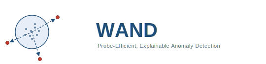
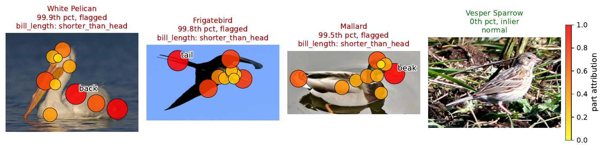
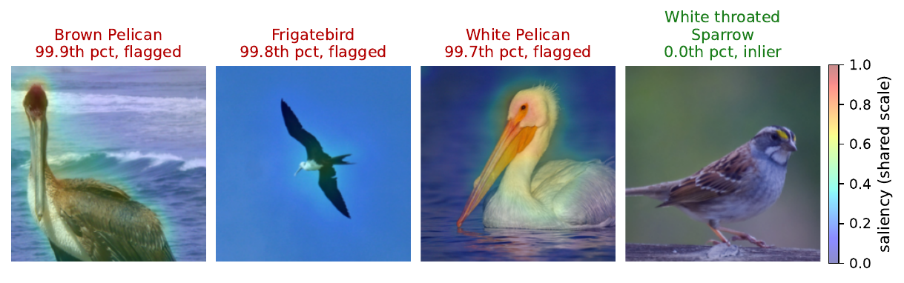

<p align="center">
  
</p>

# WAND — Witnesses Explain Anomalies

Reference implementation and benchmark drivers for the anonymous submission
**"Witnesses Explain Anomalies"**. The supplementary material is included as
`supplementary.pdf`.

WAND is an unsupervised tabular anomaly detector that is **explainable by
design**. It organises scoring around *directions* on the unit sphere: every
anomaly is exposed by one or more **witness directions** along which its
projection escapes a sub-Gaussian extreme-value baseline (median/MAD
calibrated). Because each direction is a vector in feature space, the
directions that flag a point *are* its explanation — a native per-feature
attribution obtained at no extra cost over scoring, and (since the score is
differentiable) also recoverable by gradients, down to raw-pixel saliency
through a frozen encoder. The **probe count** needed to expose every anomaly
is bounded by the anomaly count and a halfspace-depth margin, independent of
the sample size; the per-direction scan is linear in `n`, so WAND streams to
10⁷ points.

## Explanations on real images (AnoCUB)

WAND explains the **same** flagged birds two complementary ways.

*Concept-level — which named attribute:* the witness attribution names the
responsible concept (bill length) and maps it onto the bird's body keypoints
(no pixels, no labels; detection AUC 1.0).

<p align="center">
  
</p>

*Pixel-level — where in the image:* the differentiable score is
back-propagated to pixels through a frozen ResNet-18 (SmoothGrad); saliency
concentrates on the flagged birds and stays weak on the inlier (AUC 0.99).

<p align="center">
  
</p>

---

## Repository layout

```
.
├── README.md
├── LICENSE                     # MIT (anonymous)
├── requirements.txt
├── supplementary.pdf           # supplementary material (PDF)
├── figures/                    # logo + AnoCUB showcase images (generated PDFs are git-ignored)
├── results/                    # precomputed CSVs (regenerate figures/tables offline)
├── tables/                     # generated LaTeX tables (git-ignored output dir)
├── src/
│   ├── core/                   # the method (importable library)
│   │   ├── explain.py          #   WANDExplainer: scorer + witness/gradient/signed attribution
│   │   ├── anticoncentration.py#   wand_score / wand_score_torch + WANDConfig
│   │   ├── dacop.py            #   differentiable scorer utilities
│   │   └── pidforest_wrapper.py
│   ├── experiments/            # paper experiments E1–E10
│   │   ├── exp_e1_synthetic.py … exp_e10_scaling.py, exp_anocub_backbones.py
│   └── benchmarks/             # ADBench drivers
│       ├── bench_anomaly_wand.py, bench_ablation.py, bench_wand_only.py
│       ├── run_pidforest.py, run_baselines_budget.py, merge_seeds.py
│       └── diff_hp_tune.py, diff_hp_tune_lambda.py
└── tools/                      # figure/table generators
    ├── gen_figures.py          #   CD diagrams + time-vs-AUC  -> figures/
    ├── gen_tables.py           #   main detection table       -> tables/
    ├── gen_xai_assets.py       #   explanation-quality table + figure
    └── gen_fig45_combined.py   #   combined explanation/heavy-tail figure
```

## Installation

Tested with Python 3.10–3.12.

```bash
python -m venv .venv && source .venv/bin/activate
pip install -r requirements.txt
```

To enable the **PIDForest** baseline, clone the reference repo and point
`WAND_PIDFOREST_PATH` at its `code/` directory:

```bash
git clone https://github.com/vatsalsharan/pidforest third_party/pidforest
export WAND_PIDFOREST_PATH=$PWD/third_party/pidforest/code
```

The wrapper defaults to `third_party/pidforest/code` under the repo root, so
the clone above works without setting the env var.

## Datasets

We use the **47 tabular tasks of ADBench**. Place the original `.npz` files
(each with `X` and `y` arrays) under `datasets/odds/`, named
`<index>_<short>.npz` (e.g. `01_breastw.npz`, `46_speech.npz`). See
[`datasets/README.md`](datasets/README.md) for the naming convention.

**AnoCUB** is derived from **CUB-200-2011**: download the dataset archive into
`datasets/cub/` and run `python src/experiments/exp_e7_anocub.py`, which builds
and caches the exact `anocub_task.npz` (1259×312 named-concept task).

The CSVs bundled under `results/` correspond to a complete run on the suite,
so the tables and figures regenerate **without re-downloading the data**.

## Reproducing the paper

**Regenerate tables and figures from the bundled CSVs**

```bash
python tools/gen_tables.py         # -> tables/tab_main.tex (+ snippet files)
python tools/gen_figures.py        # -> figures/cd_both.pdf, figures/time_auc.pdf
python tools/gen_xai_assets.py     # -> explanation-quality table + figure
python tools/gen_fig45_combined.py # -> combined explanation/heavy-tail figure
```

**Re-run the experiments** (each writes a CSV to `results/` and figures to
`figures/`):

```bash
python src/experiments/exp_e1_synthetic.py      # synthetic ground-truth attribution
python src/experiments/exp_e2_faithfulness.py   # deletion/insertion faithfulness
python src/experiments/exp_e5_heavytail.py      # heavy-tail robustness
python src/experiments/exp_e6_deep.py           # deep baselines
python src/experiments/exp_e7_anocub.py         # AnoCUB concept-level explanation
python src/experiments/exp_e8_pixelsaliency.py  # pixel saliency
python src/experiments/exp_e9_anocub_supp.py    # AnoCUB gallery + failure modes
python src/experiments/exp_e10_scaling.py       # large-n scaling (linear to 10^7)
```

**Re-run the main benchmark from scratch** (17 methods × 47 tasks, 3 seeds):

```bash
python -m src.benchmarks.bench_anomaly_wand --seeds 0,1,2 --per_method_timeout 300
```

Writes `results/bench_anomaly_wand.csv`. Stochastic baselines and WAND are run
for each seed and averaged. **PIDForest only**:

```bash
python -m src.benchmarks.run_pidforest --budget 600 --max_mem_gb 16
```

fills the `PIDForest_*` columns. **Ablation cascade** (Base → +Spacing → +Axis
→ +Seed averaging):

```bash
python -m src.benchmarks.bench_ablation
```

## Quick start (use WAND on your own data)

```python
import numpy as np
from src.core.anticoncentration import wand_score

X = np.random.randn(2000, 20)            # n × d data
scores = wand_score(X, K=1024)           # higher = more anomalous
```

For per-feature explanations and the differentiable variant, use the inductive
scorer in `src.core.explain`:

```python
from src.core.explain import WANDExplainer
expl = WANDExplainer(K=1024).fit(X)
s   = expl.score(X)
A   = expl.witness_attribution(X, signed=True)   # +: feature too high, −: too low
G   = expl.gradient_attribution(X)               # |d score / d x| (differentiable)
```

## Hardware

All numbers in the paper were obtained on a single CPU core of a commodity
x86-64 workstation (Intel Xeon, 16 GB RAM, NumPy / PyTorch CPU, no GPU). The
full 47-dataset sweep takes ≈100 s of wall-clock for WAND and ≈40 s for
Isolation Forest; the inductive scorer streams 10⁷ points in ≈164 s.

## Note on anonymity

This repository is released for double-blind review: it contains no author
names, affiliations, or identifying metadata. Please do not add any.

## License

MIT — see [LICENSE](LICENSE).
